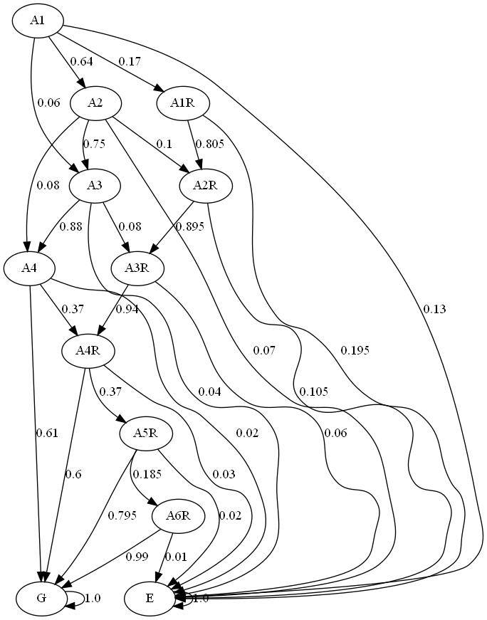

# Markov-chain-simulation
---
>
>
## Introduction

This project aims at simulating student progress in a undergraduate program. Students are generated
from a Markov chain modelling with transition probabilities. The probabilities transitions matrices used are available
at `matrix`. The possible states are: `['A1', 'A2', 'A3', 'A4', 'A5', 'A1R', 'A2R', 'A3R', 'A4R', 'A5R', 'A6R', 'A7R', 'G', 'E']`.
The code can easily be adapted to generate the Markov chain for different transition/states/probabilities.


## Make Markov diagram

A diagram of the Markov chain can be generate and drawn with `python generate_mc.py`

It uses the probability transition matrix and the possible states.




## Simulation

Simulate student progress

For this, simply run `python simulation.py`.

This will simulate students progress by year and save it at `docs/event_table0.csv`. In addition, the probability and time of graduating, dropping out and retaining students are saved at 'docs'.

The program uses a class `Student` defined in `Student.py`. This class simulates a Markov chain for one student based on Markov states and the transition probability matrix defined above.


## Survival Analysis

Survival Analysis for student dropout


## How to use?

```
Clone this repository
Make sure you have installed the packages in requirements.txt (pip install -r requirements.txt)
```
